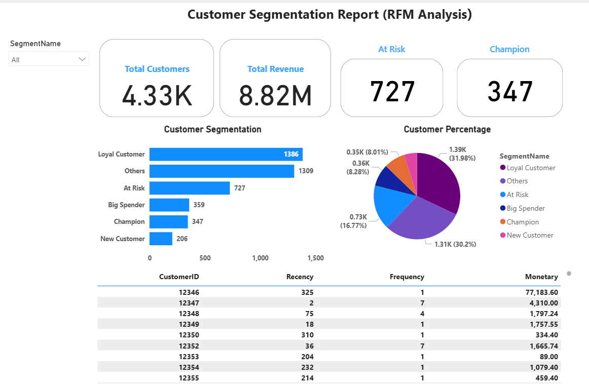

# 🧠 Customer Segmentation with RFM Analysis

This project applies RFM (Recency, Frequency, Monetary) analysis to group customers based on purchasing behavior. I used SQL for scoring, cleaned the data manually and with queries, and built a Power BI dashboard to show insights clearly.

---

## 📌 Table of Contents
- [What I Did](#what-i-did)
- [Data Cleaning](#data-cleaning)
- [RFM Scoring Logic](#rfm-scoring-logic)
- [Segmentation](#segmentation)
- [Power BI Dashboard](#power-bi-dashboard)
- [Insights](#insights)
- [Tools Used](#tools-used)
- [Files in This Repo](#files-in-this-repo)
- [Next Steps](#next-steps)

---

## 🔧 What I Did

- Cleaned up raw transaction data (returns, invalid entries)
- Created RFM metrics using SQL
- Assigned customers into 8 segments based on score combinations
- Built a Power BI dashboard to explore customer behavior interactively

---

## 🧼 Data Cleaning

- Dropped:
  - Null or blank `CustomerID`, `InvoiceNo`, and `Description`
  - Rows with negative quantity or price
  - Stock codes like `POST`, `BANK CHARGES`, `AMAZONFEE`, etc.
- Removed exact duplicates using `ROW_NUMBER()`

---

## 📊 RFM Scoring Logic

- Recency: Days since last purchase (based on max `InvoiceDate`)
- Frequency: Count of distinct invoices
- Monetary: Sum of total spend
- Used `NTILE(5)` for scoring into 1–5
- Reversed Recency score (lower is better → higher score)
- Combined scores into RFMCode (e.g. `555`, `421`)

---

## 🧩 Segmentation

Mapped RFMCode into 8 human-readable segments:

| RFM Code Pattern | Segment Name     |
|------------------|------------------|
| `555`            | Champion         |
| `5__`            | New Customer     |
| `_5_`            | Loyal Customer   |
| `__5`            | Big Spender      |
| `1__`            | At Risk          |
| `1_5`            | Can’t Lose Them  |
| `111`            | Lost             |
| everything else  | Others           |

---

## 📈 Power BI Dashboard

- KPI cards showing:
  - Total Customers
  - Total Revenue
  - Champions / At Risk counts
- Bar + Pie charts for segment distribution
- Interactive slicer by `SegmentName`
- Detailed customer-level table with Recency, Frequency, Monetary

📷 **Screenshot**  
> 

---

## 🔍 Insights

- Loyal Customers and Others make up over half the customer base
- Champions (~8%) contribute disproportionately to revenue
- Over 700 customers are At Risk and might need a re-engagement campaign

---

## 🧰 Tools Used

- SQL Server
- Power BI
- Excel (light filtering and export)

---

## 📁 Files in This Repo

| File | Description |
|------|-------------|
| File | Description |
|------|-------------|
| [`data/RFM_Segments.csv`](./data/RFM_Segments.csv) | Final result with segments |
| [`data/RFM_Base.csv`](./data/RFM_Base.csv) | Cleaned Recency, Frequency, Monetary scores |
| [`PowerBI_RFM.pbix`](./PowerBI_RFM.pbix) | Full dashboard report |
| [`rfm-analysis.sql`](./rfm-analysis.sql) | SQL logic for cleaning, scoring, and segmentation |
| [`README.md`](./README.md) | You're reading it! |

---

## 🚀 Next Steps

- Add CLTV estimation to segment logic
- Compare segment performance across time or region
- Automate refresh via database or cloud connection

---

## 👋 Let’s Connect

I'm actively learning and building. Reach out if you'd like to discuss the project or potential improvements.  
[LinkedIn](https://www.linkedin.com/in/jake-ma-0a4278282/)
